# Modulo N Adder

## Table of Contents

- [Introduction](#introduction)
- [First implementation](#first-implementation)
- [Second — and more general — implementation](#second--and-more-general--implementation)
- [Circuit synthesis](#circuit-synthesis)
- [Logic Equivalence Check — LEC](#logic-equivalence-check--lec)
- [Functional verification with a Testbench — Xcelium](#functional-verification-with-a-testbench--xcelium)
- [Placement with Innovus](#placement-with-innovus)
- [Results](#results)
- [Bibliography](#bibliography)

## Introduction

The object of this assignment was to design a Modulo N Adder, for N = 5, 9, 14 and 15, in VHDL, and then use tools for synthesis (Genus), logic equivalence checking (LEC), correctness checking with a Testbench (XCelium), and placement / implementation (Innovus).

This report contains two VHDL implementations of the requirement, and two successful synthesis, LEC, XCelium and implementation runs of the better of the two implementations (in our judgment).

## Source files

| File | Description |
|---|---|
| [`moduloaddern.vhd`](source/moduloaddern.vhd) | First implementation — top-level modulo N adder (arbitrary-moduli method) |
| [`FA.vhd`](source/FA.vhd) | 1-bit full adder |
| [`FA_n.vhd`](source/FA_n.vhd) | N-bit ripple-carry adder built from `FA` |
| [`mux2to1.vhd`](source/mux2to1.vhd) | 2-to-1 multiplexer |
| [`PU_n.vhd`](source/PU_n.vhd) | Processing unit (conditional subtractor) used by the second implementation |
| [`mod_n_adder.vhd`](source/mod_n_adder.vhd) | Second implementation — division-based modulo N adder core |
| [`QD.vhd`](source/QD.vhd) | Input/output register (D flip-flop bank with reset) |
| [`top.vhd`](source/top.vhd) | Top module — wraps `mod_n_adder` with `QD` input/output registers |
| [`tb.v`](source/tb.v) | Verilog testbench used for XCelium simulation |
| [`runproject.tcl`](tcl/runproject.tcl) | Genus synthesis script — 45nm library |
| [`runproject_7nm.tcl`](tcl/runproject_7nm.tcl) | Genus synthesis script — 7nm library |

## First implementation

The first implementation of the Modulo N Adder is based on paper [1] in the bibliography. In it, T. F. Tay and C.-H. Chang propose an implementation for a modulo N adder (and subtractor, although we don't need that) with *arbitrary moduli*, i.e. applicable to any N we want to use.

In the paper, the authors mathematically prove the formula below:

$$(A + B)\bmod M = \begin{cases} A + B, & \text{if } A + B + 2^{N} - M < 2^{N} \\ A + B + 2^{N} - M, & \text{otherwise} \end{cases}$$

Based on this, we designed the VHDL file [`moduloaddern.vhd`](moduloaddern.vhd).

The circuit uses the well-known QD module for the input/output registers ([`QD.vhd`](QD.vhd)), and for the addition, the ripple-carry adder modules we designed ([`FA.vhd`](FA.vhd), [`FA_n.vhd`](FA_n.vhd)).

First, using the `math_real` library, we define the inputs/output to have the minimum number of bits needed to represent a given modulus. That is, for mod15, the inputs and output are 4 bits. We then add the two inputs and drive the sum, together with `Cout`, into a signal `path1`. Next we add to it the correction factor `CORR` (`2^N - M`), after converting it to binary, and drive it into signal `path2`. The carry-out of this second addition is unused, so we discard it. The MSB of `path2` tells us whether the result has exceeded `2^N`. We feed `path1` and `path2` into a multiplexer selected by the MSB of `path2`, so that we get the correct output as defined by the formula above. The multiplexer output is the circuit output.

Running the circuit in ModelSim produces the expected result.

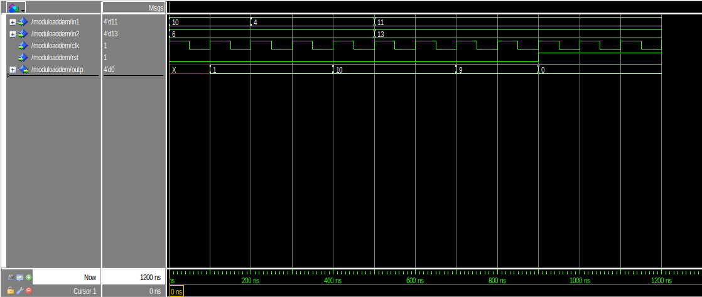

#### Note

For inputs A, B greater than or equal to the modulus M, the circuit fails. This is noted in the paper:

> "The valid range of any modulo *m* operation has to be [0, *m*−1]."

Because of this, we decided to move to a circuit of our own design, which is more general. Even so, the circuit implemented above is clearly the more efficient one for cases where this restriction doesn't matter.

## Second — and more general — implementation

The second implementation we chose is based on binary long division, taking the remainder of the division as the result.

*Example of a mod 15 architecture with a 4-bit input and divisor*

The building blocks are [`mux2to1.vhd`](mux2to1.vhd), a 2-to-1 multiplexer, and [`PU_n.vhd`](PU_n.vhd), the processing unit built from `FA_n` and `mux2to1`.

In `PU`, we feed in n bits from `ab` and subtract `d`. If the result is smaller than `d`, `PU` returns the original digits; otherwise, it returns the subtraction result. To decide which of the two `PU` outputs, we use the overflow bit as the select signal of the 2-to-1 mux.

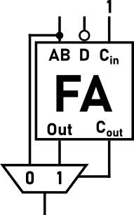
*PU circuit*

These blocks are combined in [`mod_n_adder.vhd`](mod_n_adder.vhd):

- In `loop1`, we put the correct number of leading zeros at the start of `ab`.
- In `loop2`, we place the digits of `ab`, in order, at the LSB of each block.
- In `loop3`, we feed the output of each block into the input of the next block.
- In `PU3`, we place the output in the highest-order digits separately, because that block is not the same size as the others — it is missing one leading zero.

To explain the logic behind the code: as an initial step, for a divisor "d" of length m, we place m-1 zeros at the start of the number "ab" (where ab = a+b), so that the circuit works regardless of how many leading zeros the divisor has. Therefore, the first subtraction we perform uses only the first digit of `ab`. If `00...0X < d`, then `00...0X` passes through unchanged.

For correct subtraction we need m+1 digits, since a number with a "1" in the (m+1)-th position is guaranteed to be larger than our m-digit divisor. Each subtraction of m+1 digits returns m+1 digits, but since we've shown the first digit will always be zero, we can discard it and feed the next m+1 bits into `PU`. Specifically, we have a block of m+2 digits: we place the `PU` result at positions m+2 down to LSB+1, and the next bit of `ab` at the LSB of the block. The next subtraction then uses MSB-1 down to LSB, and the loop repeats until we reach the last digit of `ab`.

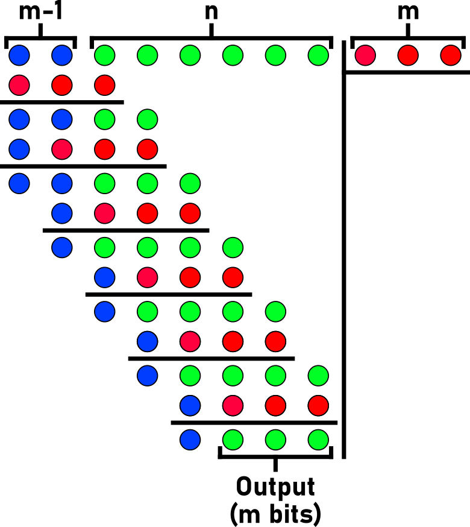
*Explanatory diagram for the n mod adder, with n=6 and m=3*

Naturally, our circuit also has input and output registers, identical to the ones used in the lab exercises ([`QD.vhd`](QD.vhd)).

Finally, to include the QD registers in the circuit, we built a top module ([`top.vhd`](top.vhd)) that is nothing more than a `mod_n_adder` unit surrounded by QD units at the input and output.

As shown in `top.vhd`, although the `mod_n_adder` module defines the modulus as a binary value, in the `top` module we define it as an integer generic. This lets us change N in the mod N adder simply by changing a number. The method we used, of course, relies on the non-synthesizable `math_real` library to convert the integer N into a binary input for `mod_n_adder`. We work around this with a single line in the `.tcl` file used for synthesis, described below.

#### Note

We considered this implementation — specifically the mod15 adder (N=15) — the one most worth carrying through Genus → LEC → XCelium → Innovus. We reached this conclusion because of how general this implementation is in terms of its applicability, since it doesn't have the restrictions of the first one.

## Circuit synthesis

This is where we ran into the project's first "difficulty": the `math_real` library is not synthesizable. It turns out, however, that a single command in the tcl file lets us get past this, by forcing the tool to evaluate the mathematical expressions before the elaboration stage.

The tcl file we used is [`runproject.tcl`](runproject.tcl).

We synthesized the design with Genus (`genus -f runproject.tcl`) across four configurations — two clock periods (10 ns, a relaxed target, and 4 ns, the fastest period we could reliably push through Innovus) on both a 45nm and a 7nm library ([`runproject_7nm.tcl`](runproject_7nm.tcl) for the 7nm runs):

| Configuration | Timing slack | Total power | Total area (cell area units) |
|---|---|---|---|
| 10 ns clock — 45nm | 8017 ps | 26.70 µW | 114.647 (69 cells) |
| 10 ns clock — 7nm | 8712 ps | 6.77 µW | not reliable — the 7nm libraries don't report accurate area data |
| 4 ns clock — 45nm | 2221 ps | 68.11 µW | 115.282 (70 cells) |
| 4 ns clock — 7nm | 2712 ps | 16.89 µW | not meaningful, same reason as above |

We initially tried to push the clock as low as 1.5 ns (leaving a slack of only 16 ps), but that timing could not be carried through an Innovus implementation. After several attempts, we found that 4 ns was the fastest clock we could reliably implement in the time available — not necessarily the absolute fastest the design could support.

Post-synthesis schematics (`gui_show`):

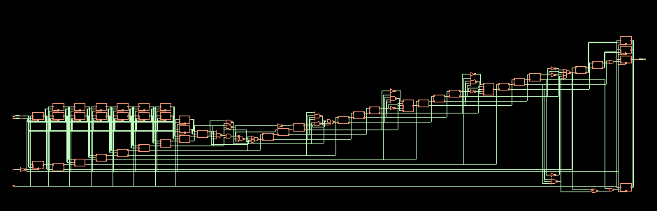
*Schematic of the circuit at 10ns clock — 45nm*

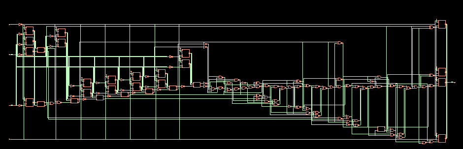
*Schematic of the circuit at 10ns clock — 7nm*

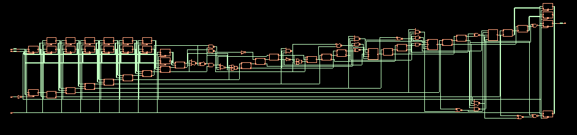
*Schematic of the circuit at 4ns clock — 45nm (identical to the 10ns schematic)*

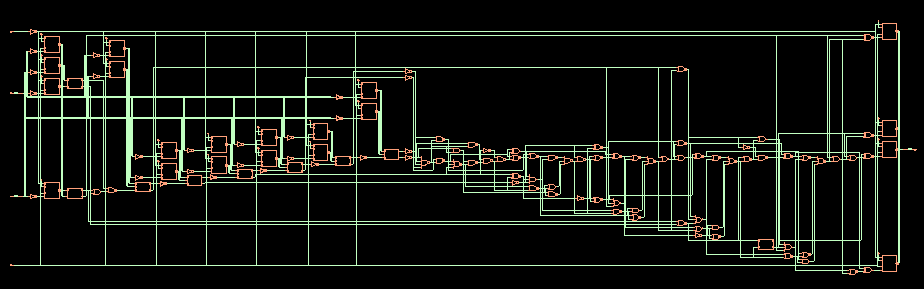
*Schematic of the circuit at 4ns clock — 7nm (identical to the 10ns schematic, since the design wasn't pushed hard enough to force a more efficient layout)*

## Logic Equivalence Check — LEC

At this stage, following the LEC tool's e-class instructions, we ran a logic equivalence check. This lets us confirm that the netlist (`top_m.v`) produced by Genus in the previous stage is truly equivalent to our VHDL implementation.

The Logic Equivalence Check returned **PASS** for both implementations, at 10 ns and at 4 ns.

## Functional verification with a Testbench — Xcelium

At this stage we wrote a Verilog testbench, as in the lab exercises, to run in the XCelium tool. This lets us confirm correct operation with known inputs and expected outputs.

Our testbench is [`tb.v`](tb.v). It applies a 50 ns clock and, after reset, drives five pairs of test inputs through the design, leaving enough time between each pair for the output to settle through the input/output registers.

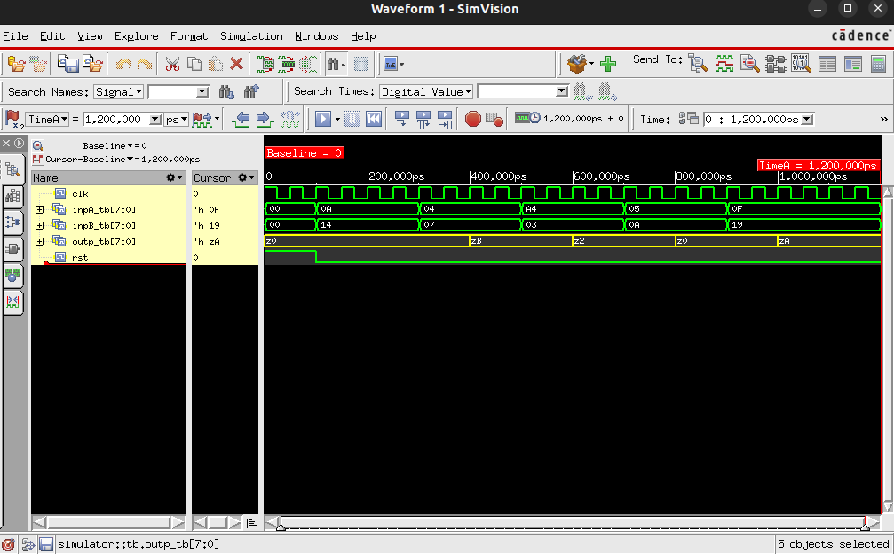

The results are exactly as expected:

- (10 + 20) mod 15 = 0
- (4 + 7) mod 15 = 11
- (164 + 3) mod 15 = 2
- (5 + 10) mod 15 = 0
- (15 + 25) mod 15 = 10

So XCelium confirms our circuit behaves smoothly and as expected.

## Placement with Innovus

In the final stage of the project, using the files produced by Genus synthesis, we ran placement for both circuits (10 ns and 4 ns) with Innovus.

### Placement at 10 ns

Following the e-class instructions, we created the constraints and imported the Genus files (`sdc`, `v`, `sdf`) for both implementations. We then set the floorplan (`floorplan > specify floorplan`) with a core-to-left/right/top/bottom margin of 2.0. Next we defined the power rings (`power > power planning > add rings`) named VDD and VSS, with 0.4 spacing/width and a 0.5 offset. Finally, we placed the power stripes (`power > power planning > add stripes`) named VDD/VSS on Metal6, with 0.4 width/spacing, one set, starting 10 units from the left.

Initial placement:

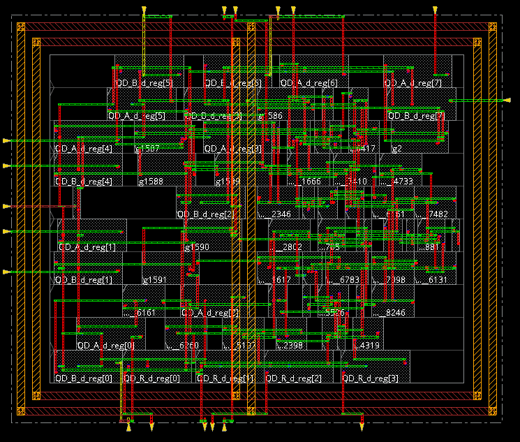

After defining the clock tree and running `clock_opt_design`:

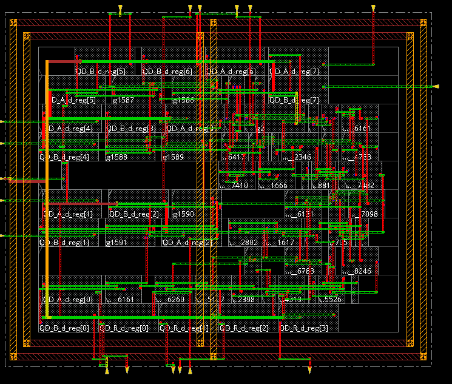

Post-CTS optimization:

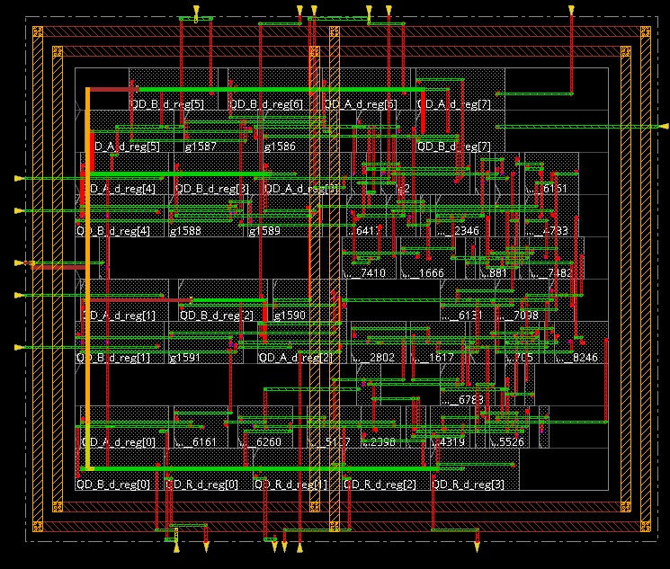

Routing:

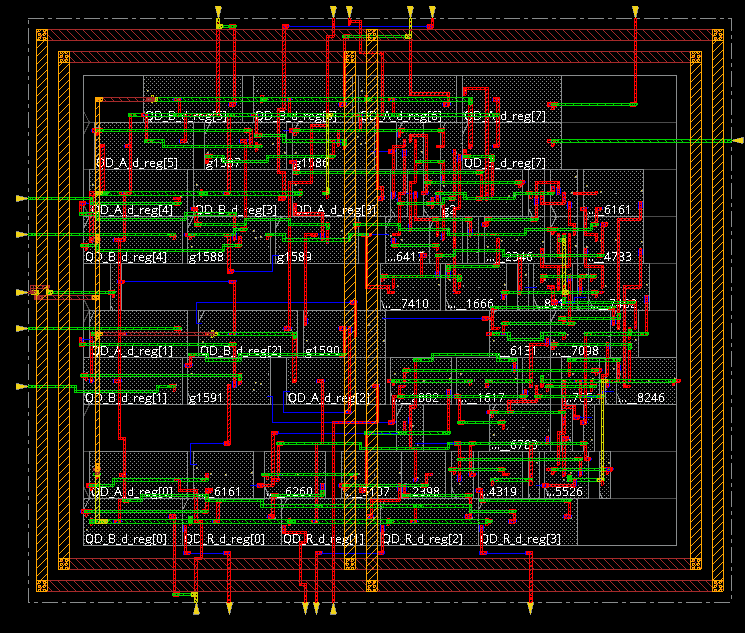

Filler cells:

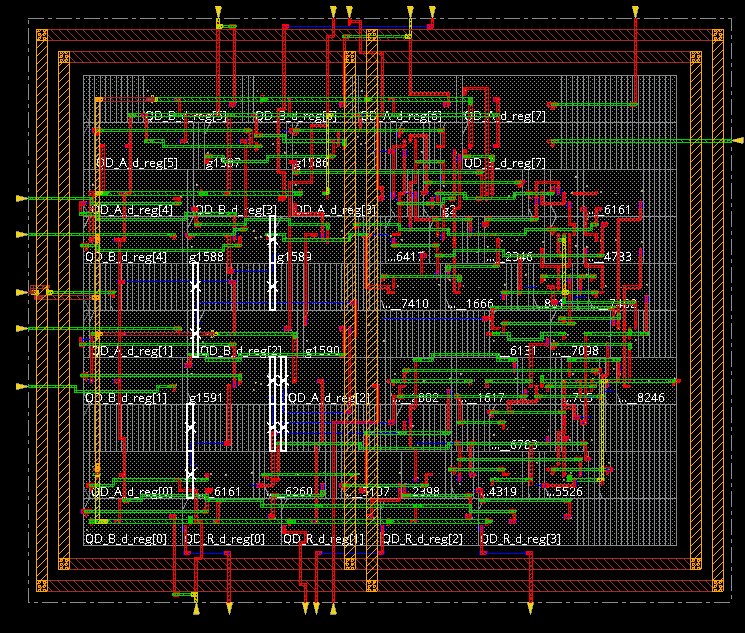

Post-route optimization:

The resulting circuit had DRC violations, so we ran `ecoRoute -fix_drc` to fix them. The final circuit:

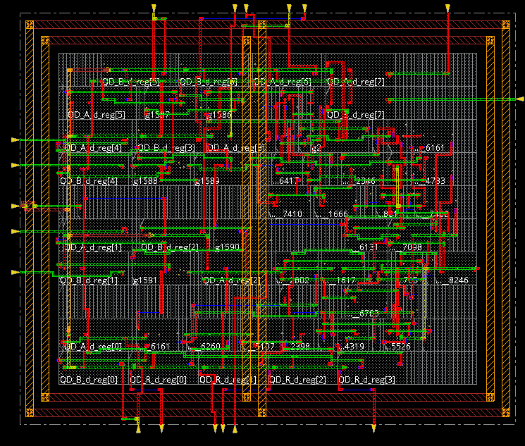

And the clock tree viewer:

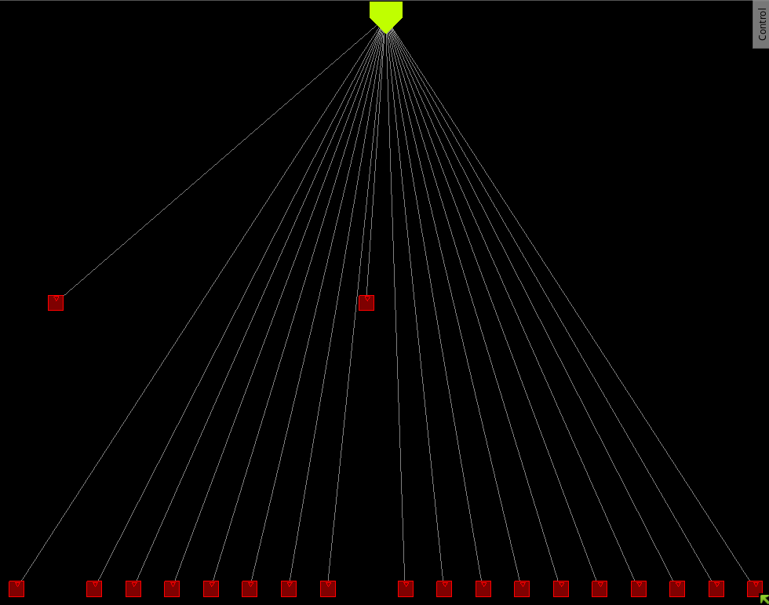

With this, we could run `verify_drc`, `verify_connectivity`, and `verify_geometry`, and all three came back clean after the last command we ran.

### Placement at 4 ns

We followed exactly the same process as at 10 ns, except that this time, due to the higher density of the circuit, the floorplan step required a core utilization lower than the ~70% default — we used 50% (0.5). Innovus auto-corrected this to ~0.499, and we continued the remaining steps normally. Post-route optimization:

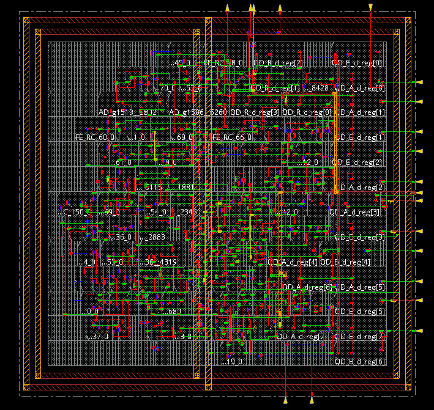

Here we again had to run `ecoRoute` for DRC violations.

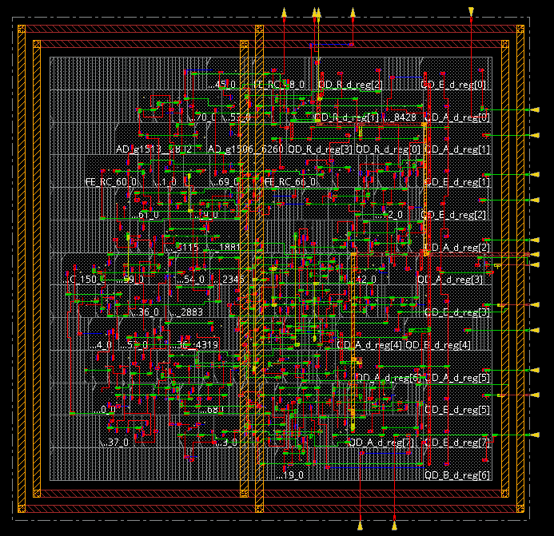

And our final clock tree:

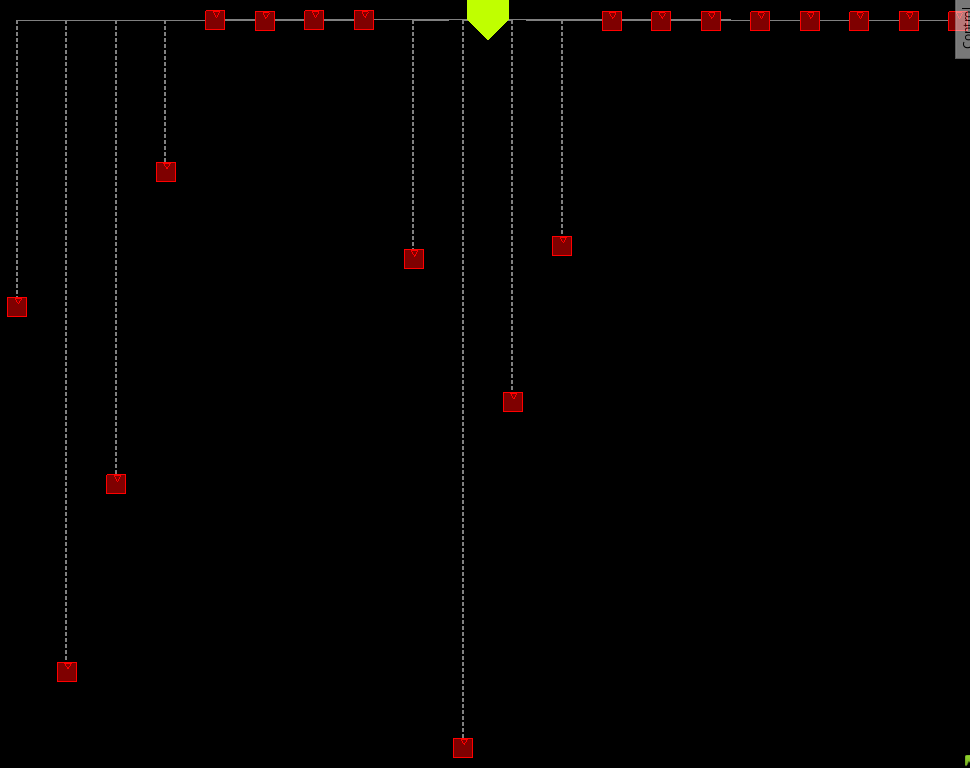

We now have two different placements of the same circuit for two different clock targets.

## Results

Working on this project gave us more hands-on experience with the tools used in industry for ASIC and FPGA design, and deepened our knowledge of VHDL. It also pushed us to look for outside resources to implement more efficient circuits, and to work around problems we ran into in Genus (for example, support for `real` types during synthesis) and in Innovus. Finally, we've now implemented a project that adds to our own personal library of designs.

## Bibliography

[1] T. F. Tay and C.-H. Chang, "A new unified modular adder/subtractor for arbitrary moduli," *2015 IEEE International Symposium on Circuits and Systems (ISCAS)*, Lisbon, Portugal, 2015, pp. 53-56, doi: [10.1109/ISCAS.2015.7168568](https://ieeexplore.ieee.org/document/7168568).
